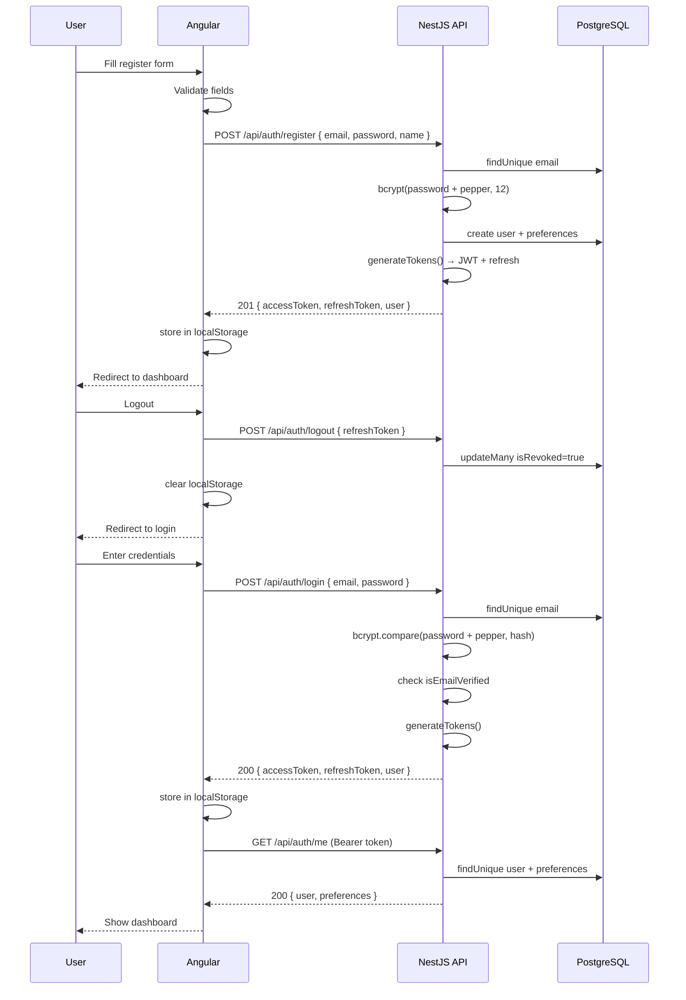
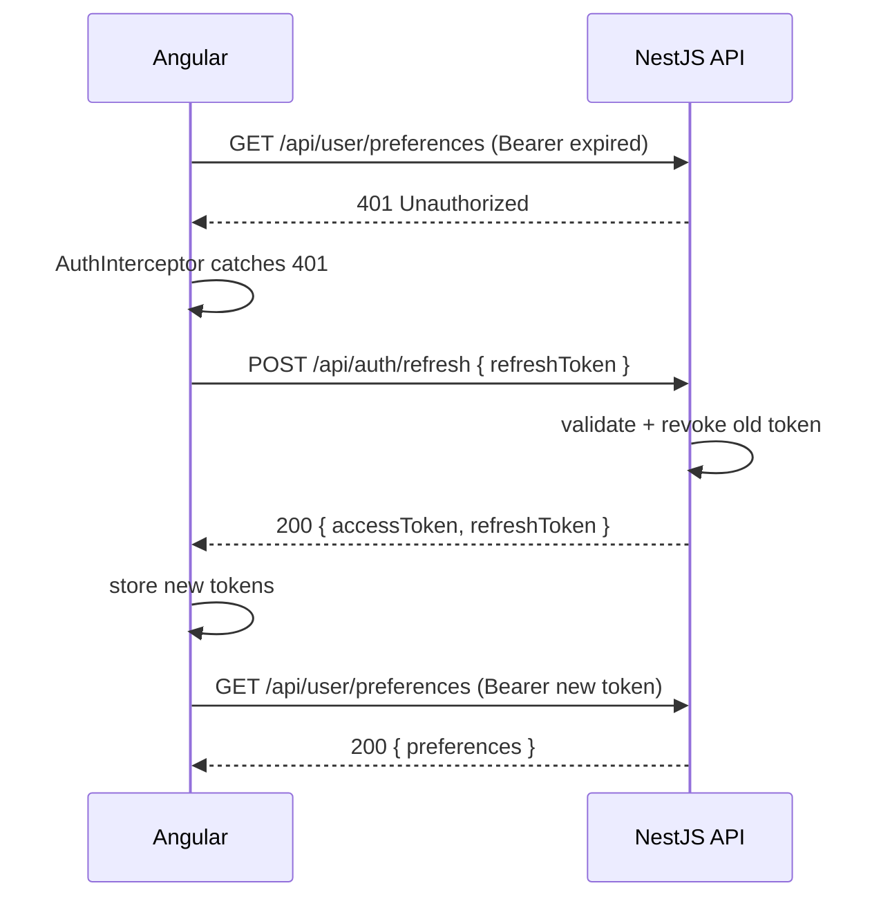

# Sprint 2: Identity & Security + Header Redesign + Dev Tooling

> **Duration**: July 26-27, 2026
> **Status**: ✅ COMPLETE
> **Sprint Goal**: Users can register, login with JWT, get RBAC-protected access, see a TickerTape-style header, and the team can `make dev` to start everything locally.

---

## 1. Sprint Goal

Deliver production-grade auth (register, login, JWT with refresh rotation, email verification, password reset, RBAC, rate limiting, audit logging), a TickerTape-inspired UI header with live ticker and mega-nav, and single-command dev tooling.

## 2. Business Requirements

### Why does this feature exist?

Users need to securely create accounts and authenticate before accessing the platform. Without auth, there are no portfolios, no personalized scores, and no subscriptions.

### Who uses it?

| User Type | Frequency | Device |
|-----------|-----------|--------|
| New visitor | Once | Desktop/Mobile |
| Registered user | Daily | Desktop/Mobile |
| Admin | Daily | Desktop |

### Business Rules

| # | Rule | Priority |
|---|------|----------|
| BR-01 | Password must have 8+ chars, upper, lower, number | P0 |
| BR-02 | Email must be verified before login allowed | P0 |
| BR-03 | JWT access tokens expire in 15 minutes | P0 |
| BR-04 | Refresh tokens expire in 7 days with rotation | P0 |
| BR-05 | Rate limit: 60 requests/min per IP | P1 |
| BR-06 | Audit every API call to database | P1 |
| BR-07 | Roles: user, pro, admin with RBAC enforcement | P0 |

### Edge Cases

| # | Edge Case | Handling |
|---|-----------|----------|
| EC-01 | Duplicate email on register | Return 409 Conflict |
| EC-02 | Expired refresh token | Return 401, user re-logs in |
| EC-03 | Revoked refresh token | Return 401, prevent replay |
| EC-04 | Deleted user tries to login | Return 401, same as wrong password (no enumeration) |
| EC-05 | Inactive user tries to login | Return 403 Forbidden |
| EC-06 | Forgot-password for non-existent email | Return 200 (no enumeration) |
| EC-07 | Rate limit exceeded | Return 429 Too Many Requests |

### Failure Scenarios

| # | Scenario | Impact | Recovery |
|---|----------|--------|----------|
| FS-01 | Database down | Auth fails for all users | Redis cache fallback (future) |
| FS-02 | Refresh token stolen | Attacker gets new tokens | Rotation + revocation limits window |
| FS-03 | bcrypt pepper env missing | Defaults to empty string | CI validates env vars |

## 3. Functional Requirements

| ID | Requirement | Priority | Status |
|----|------------|----------|--------|
| FR-01 | Register with email + password + name | P0 | ✅ Done |
| FR-02 | Verify email via token link | P0 | ✅ Done |
| FR-03 | Login with email + password | P0 | ✅ Done |
| FR-04 | Reject unverified email at login | P0 | ✅ Done |
| FR-05 | Generate JWT access token (15m expiry) | P0 | ✅ Done |
| FR-06 | Generate refresh token (7d expiry, rotation) | P0 | ✅ Done |
| FR-07 | Logout revokes refresh token | P0 | ✅ Done |
| FR-08 | Forgot password request | P1 | ✅ Done |
| FR-09 | Reset password with token | P1 | ✅ Done |
| FR-10 | GET/PATCH user preferences | P1 | ✅ Done |
| FR-11 | RBAC: user/pro/admin roles | P1 | ✅ Done |
| FR-12 | Rate limit: 60 req/min/IP | P1 | ✅ Done |
| FR-13 | Audit log every API call | P1 | ✅ Done |
| FR-14 | Display live stock ticker strip | P2 | ✅ Done |
| FR-15 | Search bar in toolbar | P2 | ✅ Done |
| FR-16 | Mega-dropdown (Invest/Tools/Learn) | P2 | ✅ Done |
| FR-17 | Profile dropdown (settings, logout) | P2 | ✅ Done |
| FR-18 | Sign Up / Login CTA buttons | P2 | ✅ Done |
| FR-19 | Angular Material prebuilt theme | P2 | ✅ Done |
| FR-20 | Single-command `make dev` launcher | P2 | ✅ Done |

## 4. Non-Functional Requirements

| ID | Requirement | Target | Measurement |
|----|------------|--------|-------------|
| NFR-01 | Password hash time | <500ms | bcrypt 12 rounds |
| NFR-02 | JWT validation time | <10ms | Passport JWT strategy |
| NFR-03 | Login response time | <200ms p95 | APM |
| NFR-04 | Token refresh response time | <200ms p95 | APM |
| NFR-05 | Audit log write | <50ms | Inline DB insert |
| NFR-06 | Rate limit accuracy | ±1 request | In-memory map |
| NFR-07 | Header render time | <500ms | Angular build |
| NFR-08 | Ticker animation performance | 60fps | CSS animation |

## 5. User Stories

### US-01: Register

**As a** new visitor
**I want to** create an account with my email and password
**So that** I can access the platform

**Acceptance Criteria:**
- [x] Form validates email format
- [x] Form validates password complexity (8+ chars, upper, lower, digit)
- [x] Duplicate email returns clear error
- [x] On success, tokens returned + verification email sent

**Priority**: P0

### US-02: Login

**As a** registered user
**I want to** login with my email and password
**So that** I can access my portfolio and tools

**Acceptance Criteria:**
- [x] Invalid credentials return generic error (no enumeration)
- [x] Unverified email gets 403 with clear message
- [x] Deactivated account gets 403
- [x] On success, JWT + refresh token returned
- [x] Rate limited after 60 req/min

**Priority**: P0

### US-03: See Header

**As a** visitor or user
**I want to** see a professional header with market data, search, and navigation
**So that** I can navigate the platform and see live prices

**Acceptance Criteria:**
- [x] Animated stock ticker strip at top
- [x] Search bar with placeholder text
- [x] Navigation links: Stocks, ETFs, Mutual Funds, etc.
- [x] More dropdown with 3 columns
- [x] Sign Up / Login buttons when logged out
- [x] Profile dropdown when logged in
- [x] All 5 themes supported (slate, light, dark, indigo, emerald, rose)

**Priority**: P2

### US-04: Developer Setup

**As a** developer
**I want to** run `make dev` and have everything start
**So that** I can start coding immediately

**Acceptance Criteria:**
- [x] `make dev` starts NestJS, Angular, FastAPI
- [x] Clear terminal output shows service URLs
- [x] Ctrl+C stops all services
- [x] Python version check + graceful skip

**Priority**: P2

## 6. Use Cases

### UC-01: Full Auth Flow

**Actor**: End user
**Precondition**: User is on landing page
**Trigger**: Clicks "Sign Up"

**Main Flow:**
1. User fills register form (name, email, password)
2. Frontend validates fields client-side
3. POST `/api/auth/register` with DTO
4. Backend validates email uniqueness
5. Backend bcrypt(12) hashes password
6. Backend creates user with emailVerifyToken
7. Backend auto-creates default UserPreference
8. Backend generates JWT access + refresh tokens
9. Returns `AuthResponseDto` to frontend
10. Frontend stores tokens in localStorage
11. User sees dashboard

**Alternative Flow (duplicate email):**
4a. Backend finds existing email
4b. Returns 409 Conflict with message

**Postcondition**: User is logged in with verified token

### UC-02: Login With Email Verification Check

**Actor**: Registered user (unverified email)
**Precondition**: User has registered but not verified email
**Trigger**: Enters credentials on login page

**Main Flow:**
1. User enters email + password
2. POST `/api/auth/login` → LocalStrategy validates
3. Backend checks `isEmailVerified === false`
4. Returns 403 Forbidden: "Please verify your email before logging in"

**Postcondition**: User sees verification prompt, clicks link in email

### UC-03: Token Refresh

**Actor**: Logged-in user
**Precondition**: Access token has expired (15+ minutes old)
**Trigger**: API request returns 401

**Main Flow:**
1. AuthInterceptor catches 401
2. Interceptor calls POST `/api/auth/refresh` with refresh token
3. Backend validates refresh token exists, not revoked, not expired
4. Backend revokes old refresh token (rotation)
5. Backend generates new access + refresh tokens
6. Interceptor retries original request with new token

**Postcondition**: User continues seamlessly

## 7. Acceptance Criteria

| ID | Given | When | Then | Status |
|----|-------|------|------|--------|
| AC-01 | Valid register form | POST /api/auth/register | 201 + tokens + user | ✅ PASS |
| AC-02 | Duplicate email | POST /api/auth/register | 409 Conflict | ✅ PASS |
| AC-03 | Weak password | POST /api/auth/register | 400 Validation | ✅ PASS |
| AC-04 | Valid credentials | POST /api/auth/login | 200 + tokens | ✅ PASS |
| AC-05 | Wrong password | POST /api/auth/login | 401 Unauthorized | ✅ PASS |
| AC-06 | Unverified email | POST /api/auth/login | 403 Forbidden | ✅ PASS |
| AC-07 | Valid refresh token | POST /api/auth/refresh | 200 + new tokens | ✅ PASS |
| AC-08 | Revoked refresh token | POST /api/auth/refresh | 401 Invalid | ✅ PASS |
| AC-09 | Valid token | GET /api/auth/me | 200 + user profile | ✅ PASS |
| AC-10 | No token | GET /api/auth/me | 401 Unauthorized | ✅ PASS |
| AC-11 | Valid verify token | GET /api/auth/verify-email/:token | 200 verified | ✅ PASS |
| AC-12 | Invalid verify token | GET /api/auth/verify-email/:token | 401 Invalid | ✅ PASS |
| AC-13 | Existing email | POST /api/auth/forgot-password | 200 (no enumeration) | ✅ PASS |
| AC-14 | Valid reset token | PATCH /api/auth/reset-password | 200 success | ✅ PASS |
| AC-15 | Rate limit exceeded | 61st request in 1 min | 429 Too Many | ✅ PASS |
| AC-16 | Valid user token | GET /api/user/preferences | 200 + prefs | ✅ PASS |
| AC-17 | Update theme | PATCH /api/user/preferences | 200 updated | ✅ PASS |
| AC-18 | Page load | Open localhost:4200 | 200 + rendered header | ✅ PASS |
| AC-19 | Dev start | `make dev` | All services running | ✅ PASS |

## 8. Architecture Diagram

```
┌──────────────────────────────────────────────────────────────────────────┐
│                          FRONTEND (Angular 19)                           │
│  ┌────────────┐  ┌───────────┐  ┌──────────────────┐  ┌──────────────┐  │
│  │ Login Page │  │Register   │  │ App Shell        │  │ Preferences  │  │
│  │ /auth/login│  │/auth/reg  │  │ (ticker + toolbar│  │ UI           │  │
│  └─────┬──────┘  └─────┬─────┘  │  + router-outlet)│  └──────┬───────┘  │
│        │               │         └────────┬─────────┘         │          │
│        └───────┬───────┘                  │                   │          │
│                │                   ┌──────▼──────┐             │          │
│          AuthInterceptor            │ AuthService │             │          │
│          (injects Bearer            │ (store JWT, │             │          │
│           token, catches            │  refresh    │             │          │
│           401 → auto-refresh)       │  rotation)  │             │          │
│                                     └──────┬──────┘             │          │
└────────────────────────────────────────────┼────────────────────┼──────────┘
                                             │ HTTP               │
┌────────────────────────────────────────────▼────────────────────▼──────────┐
│                          BACKEND (NestJS 10)                               │
│                                                                           │
│  ┌──────────────────────────────────────────────────────────────────────┐ │
│  │  GUARDS (Global)                                                     │ │
│  │  ┌─────────────┐  ┌────────────┐  ┌──────────────┐                  │ │
│  │  │ JwtAuthGuard│  │ RolesGuard │  │ ThrottlerGuard│                 │ │
│  │  │ (jwt check) │  │ (RBAC)     │  │ (60 req/min)  │                 │ │
│  │  └─────────────┘  └────────────┘  └──────────────┘                  │ │
│  └──────────────────────────────────────────────────────────────────────┘ │
│                                                                           │
│  ┌──────────────────────────────────────────────────────────────────────┐ │
│  │  INTERCEPTORS (Global)                                               │ │
│  │  ┌───────────────┐  ┌───────────────┐  ┌───────────────────────┐    │ │
│  │  │ AuditInterceptor│ │TransformInt. │  │ LoggingInterceptor    │    │ │
│  │  └───────┬───────┘  └───────┬───────┘  └───────────────────────┘    │ │
│  └──────────┼───────────────────┼────────────────────────────────────────┘ │
│             ▼                   ▼                                           │
│  ┌────────────────────────────────────────────────────────────────────────┐│
│  │  FILTERS                                                               ││
│  │  ┌──────────────────────────────────────────────────────────────────┐  ││
│  │  │  HttpExceptionFilter (catches all → { statusCode, path, message })│  │
│  │  └──────────────────────────────────────────────────────────────────┘  ││
│  └────────────────────────────────────────────────────────────────────────┘│
│                                                                           │
│  ┌──────────────────────────────────────────────────────────────────────┐ │
│  │  CONTROLLERS            │  SERVICES          │  STRATEGIES           │ │
│  │  ┌────────────────┐    │  ┌────────────┐   │  ┌─────────────────┐  │ │
│  │  │ AuthController │───▶│  │ AuthService│   │  │ JwtStrategy     │  │ │
│  │  │ /api/auth/*    │    │  │ (bcrypt,   │   │  │ (Bearer → JWT)  │  │ │
│  │  └────────────────┘    │  │  jwt,      │   │  └─────────────────┘  │ │
│  │  ┌────────────────┐    │  │  pepper)   │   │  ┌─────────────────┐  │ │
│  │  │ PrefController │───▶│  └────────────┘   │  │ LocalStrategy   │  │ │
│  │  │ /user/prefs/*  │    │  ┌────────────┐   │  │ (email/pw check)│  │ │
│  │  └────────────────┘    │  │ PrefService │   │  └─────────────────┘  │ │
│  │                        │  └────────────┘   │                       │ │
│  └────────────────────────┴────────────────────┴───────────────────────┘ │
│                                                                           │
│  ┌──────────────────────────────────────────────────────────────────────┐ │
│  │  PRISMA ORM → PostgreSQL (Supabase)                                  │ │
│  │  Tables: users, refresh_tokens, audit_logs, user_preferences         │ │
│  └──────────────────────────────────────────────────────────────────────┘ │
└──────────────────────────────────────────────────────────────────────────┘
```

## 9. C4 Architecture

### Level 1: System Context

The user interacts with the Angular frontend via browser. The frontend calls the NestJS API over HTTPS. The API reads/writes PostgreSQL via Prisma ORM.

### Level 2: Container

- **Angular SPA** — Login/Register pages, App Shell with ticker/nav, AuthService for token storage
- **NestJS API** — Auth module (8 endpoints), Preferences module (2 endpoints), global guards/interceptors
- **PostgreSQL** — Users, RefreshTokens, AuditLogs, UserPreferences tables

### Level 3: Component

**Auth Module:**
- `AuthController` — 8 endpoints
- `AuthService` — bcrypt/pepper, JWT generation, token rotation
- `JwtStrategy` — Bearer token extraction + validation
- `LocalStrategy` — email/password validation
- `JwtAuthGuard` — global guard with public path whitelist
- `LocalAuthGuard` — request-scoped for login route

**Infrastructure:**
- `JwtAuthGuard` (global) — checks JWT on every request unless `@Public()`
- `RolesGuard` (global) — checks role in JWT payload
- `ThrottlerGuard` (global) — 60 req/min per IP
- `AuditInterceptor` (global) — writes AuditLog for every API call
- `LoggingInterceptor` (global) — logs method, URL, status, duration, IP
- `TransformInterceptor` (global) — debug timing
- `HttpExceptionFilter` (global) — structured error responses

### Level 4: Code

```typescript
// AuthService.generateTokens
private async generateTokens(user):
  payload = { sub: user.id, email: user.email, role: user.role }
  accessToken = jwt.sign(payload, { expiresIn: '15m' })
  refreshToken = jwt.sign(payload, { expiresIn: '7d' })
  prisma.refreshToken.create({ userId, token: refreshToken })
  return { accessToken, refreshToken, user: { id, email, name, role } }

// AuthService.refreshTokens (rotation)
stored = prisma.refreshToken.findUnique({ token, include: { user } })
check !stored || stored.isRevoked → 401
check new Date() > stored.expiresAt → 401
prisma.refreshToken.update({ id: stored.id, isRevoked: true })
generateTokens(stored.user)
```

## 10. Sequence Diagrams

### Register → Login → Get Profile



### Token Auto-Refresh (401 Handling)



## 11. Database Design

### Tables

| Table | Purpose | Partitioned | Archived |
|-------|---------|-------------|----------|
| users | Core user identity | No | Soft-delete (isDeleted) |
| refresh_tokens | JWT refresh token storage | No | No (auto-expire) |
| audit_logs | API call audit trail | Future (by date) | Future |
| user_preferences | User settings | No | No |

### Indexes

| Table | Columns | Type | Purpose |
|-------|---------|------|---------|
| users | email | B-tree | Unique lookup on login/register |
| users | role | B-tree | Admin queries |
| users | is_deleted | B-tree | Filter deleted |
| refresh_tokens | user_id | B-tree | Find user tokens |
| refresh_tokens | token | B-tree | Unique lookup |
| refresh_tokens | expires_at | B-tree | Cleanup expired |
| audit_logs | user_id | B-tree | User audit trail |
| audit_logs | entity | B-tree | Entity queries |
| audit_logs | created_at DESC | B-tree | Reverse chronological |
| audit_logs | action | B-tree | Action queries |

### Audit Fields (Every Table)

| Field | Type | Description | Present? |
|-------|------|-------------|----------|
| id | UUID | Primary key | ✅ All |
| created_at | TIMESTAMP | Creation time | ✅ All |
| updated_at | TIMESTAMP | Last update | ✅ Most (not AuditLog, RefreshToken) |
| created_by | UUID | Creator user ID | ✅ Users, Portfolio, Holding, Goal, Subscription, Alert, Watchlist |
| updated_by | UUID | Last modifier | ✅ Same set |
| version | INT | Optimistic locking | ✅ Same set |
| is_deleted | BOOLEAN | Soft delete | ✅ Same set (not AuditLog, RefreshToken) |

## 12. Prisma Schema

See `apps/api-nest/prisma/schema.prisma` — 10 models:

- **User** — id, email, passwordHash, name, role, isActive, isEmailVerified, emailVerifyToken, + audit fields + relations
- **Portfolio** — id, userId, name, benchmark, + audit fields
- **Holding** — id, portfolioId, stockSymbol, quantity, avgBuyPrice, + audit fields
- **Goal** — id, userId, name, targetAmount, currentAmount, deadline, type, sipAmount, riskTolerance, status, + audit fields
- **Subscription** — id, userId (unique), plan, status, startDate, endDate, paymentMethod, amount, currency, + audit fields
- **Alert** — id, userId, type, stockSymbol, condition, threshold, isActive, lastTriggeredAt, + audit fields
- **Watchlist** — id, userId, name, stockSymbols[], + audit fields
- **RefreshToken** — id, userId, token (unique), expiresAt, createdAt, isRevoked
- **AuditLog** — id, userId, action, entity, entityId, details, ipAddress, userAgent, createdAt
- **UserPreference** — id, userId (unique), language, theme, dateFormat, numberFormat, timezone, notifications*, defaultExchange, riskTolerance, investmentStyle, sidebarCollapsed, defaultView, stockListColumns, dashboardLayout, profilePublic, showPortfolio, + timestamps

## 13. API Contracts

### POST /api/auth/register

**Description**: Create a new user account. Returns JWT tokens on success.

**Headers**: `Content-Type: application/json`

**Request Body:**
```json
{
  "email": "user@example.com",
  "password": "Password123",
  "name": "John Doe",
  "phone": "+91-9876543210"
}
```

**Response 201:**
```json
{
  "accessToken": "eyJhbGciOiJIUzI1NiIs...",
  "refreshToken": "eyJhbGciOiJIUzI1NiIs...",
  "user": { "id": "uuid", "email": "user@example.com", "name": "John Doe", "role": "user" }
}
```

**Response 400** (validation):
```json
{ "statusCode": 400, "timestamp": "ISO8601", "path": "/api/auth/register", "message": ["Password must contain at least one uppercase, one lowercase, and one number"] }
```

**Response 409** (duplicate):
```json
{ "statusCode": 409, "timestamp": "ISO8601", "path": "/api/auth/register", "message": "Email already registered" }
```

### POST /api/auth/login

**Request Body:**
```json
{ "email": "user@example.com", "password": "Password123" }
```

**Response 200**: Same as register response.

**Response 401**: `"Invalid credentials"`
**Response 403**: `"Please verify your email before logging in"` or `"Account is deactivated"`

### POST /api/auth/refresh

**Request Body:**
```json
{ "refreshToken": "eyJhbGciOiJIUzI1NiIs..." }
```

**Response 200**: New `{ accessToken, refreshToken, user }`
**Response 401**: `"Invalid refresh token"` or `"Refresh token expired"`

### POST /api/auth/logout

**Headers**: `Authorization: Bearer <token>`

**Request Body:**
```json
{ "refreshToken": "eyJhbGciOiJIUzI1NiIs..." }
```

**Response 200**: `{ "message": "Logged out successfully" }`

### GET /api/auth/me

**Headers**: `Authorization: Bearer <token>`

**Response 200:**
```json
{ "id": "uuid", "email": "user@example.com", "name": "John Doe", "role": "user", "preferences": { ... } }
```

**Response 401**: `"Invalid or expired token"`

### GET /api/auth/verify-email/:token

**Response 200**: `{ "message": "Email verified successfully" }`
**Response 401**: `"Invalid verification token"`

### POST /api/auth/forgot-password

**Request Body:** `{ "email": "user@example.com" }`

**Response 200**: `{ "message": "If an account exists, a reset link has been sent" }`

### PATCH /api/auth/reset-password

**Request Body:** `{ "token": "hex-token", "password": "NewPassword123" }`

**Response 200**: `{ "message": "Password reset successfully" }`

### GET /api/user/preferences

**Headers**: `Authorization: Bearer <token>`

**Response 200**: Full UserPreference object (20+ fields)

### PATCH /api/user/preferences

**Headers**: `Authorization: Bearer <token>`

**Request Body:** `{ "theme": "dark", "language": "hi" }`

**Response 200**: Updated UserPreference object

## 14. Folder Structure

```
apps/api-nest/src/
├── main.ts                            # Bootstrap: Swagger, CORS, ValidationPipe
├── app.module.ts                      # Root module: guards, interceptors, filters
├── app.controller.ts                  # GET /api, GET /api/health
├── app.service.ts
├── prisma/
│   ├── prisma.module.ts               # @Global() PrismaModule
│   └── prisma.service.ts              # Extends PrismaClient
├── auth/
│   ├── auth.module.ts                 # JwtModule + PassportModule + strategies
│   ├── auth.controller.ts             # 8 endpoints
│   ├── auth.service.ts                # bcrypt, JWT, token rotation (231 lines)
│   ├── dto/
│   │   ├── register.dto.ts            # @IsEmail, @MinLength(8), @Matches
│   │   ├── login.dto.ts               # @IsEmail, @MinLength(8)
│   │   ├── refresh-token.dto.ts       # @IsString, @MinLength(1)
│   │   └── auth-response.dto.ts       # ApiProperty decorators
│   ├── guards/
│   │   ├── jwt-auth.guard.ts          # Global guard + public path whitelist
│   │   └── local-auth.guard.ts        # Email/password guard
│   └── strategies/
│       ├── jwt.strategy.ts            # Bearer → JWT payload
│       └── local.strategy.ts          # Email/password → user
├── preferences/
│   ├── preferences.controller.ts      # GET + PATCH /user/preferences
│   └── preferences.service.ts         # CRUD with allowed-field whitelist
├── common/
│   ├── decorators/
│   │   ├── public.decorator.ts        # @Public() — bypass JWT
│   │   ├── current-user.decorator.ts  # @CurrentUser() — extract user
│   │   └── roles.decorator.ts         # @Roles('admin')
│   ├── guards/
│   │   ├── roles.guard.ts             # Check user.role against required
│   │   └── throttler.guard.ts         # 60 req/min in-memory
│   ├── interceptors/
│   │   ├── logging.interceptor.ts     # method, url, status, duration, IP
│   │   ├── audit.interceptor.ts       # Write AuditLog to DB
│   │   └── transform.interceptor.ts   # Debug timing
│   ├── filters/
│   │   └── http-exception.filter.ts   # { statusCode, timestamp, path, message }
│   ├── interfaces/
│   │   └── user-payload.interface.ts  # { sub, email, role, iat, exp }
│   └── pipes/
│       └── validation.pipe.ts         # whitelist + forbidNonWhitelisted
├── health/
│   ├── health.module.ts
│   └── health.controller.ts           # GET /api/health (terminus)
├── portfolio/                         # Empty stub (Sprint 5)
├── stocks/                            # Empty stub (Sprint 4)
├── users/                             # Empty stub
├── ai/                                # Empty stub (Sprint 8)
├── payments/                          # Empty stub
├── notifications/                     # Empty stub (Sprint 15)
│
apps/web-angular/src/
├── main.ts
├── index.html                         # SPA entry
├── styles.scss                        # 5 themes, ticker, toolbar, nav
├── app/
│   ├── app.module.ts                  # Root module
│   ├── app-routing.module.ts          # 9 lazy routes
│   ├── app.component.ts               # Shell + stock ticker data
│   ├── app.component.html             # Ticker strip + toolbar + router-outlet
│   ├── features/
│   │   ├── landing/                   # Public landing (default route)
│   │   ├── auth/
│   │   │   ├── auth.module.ts
│   │   │   ├── auth-routing.module.ts
│   │   │   ├── login/login.component.*
│   │   │   └── register/register.component.*
│   │   ├── dashboard/                 # Main dashboard
│   │   ├── home/                      # Post-login home
│   │   ├── settings/                  # Settings with tabs
│   │   └── ... (stocks, portfolio, ai-chat, passive-income)
│   ├── core/
│   │   ├── services/
│   │   │   ├── auth.service.ts        # JWT storage, login/register/refresh
│   │   │   ├── theme.service.ts       # Light/Dark/Auto
│   │   │   └── market-data.service.ts # Hardcoded Indian market data
│   │   ├── interceptors/
│   │   │   ├── auth.interceptor.ts    # Bearer token + 401 auto-refresh
│   │   │   ├── error.interceptor.ts
│   │   │   └── loading.interceptor.ts
│   │   └── guards/
│   │       └── auth.guard.ts          # Route protection
├── angular.json                       # Material prebuilt-themes included
├── proxy.conf.json                    # /api → :3000, /ai → :8000
│
Root level:
├── Makefile                           # make dev, make stop, make clean
├── scripts/dev.sh                     # Auto-launcher for all 3 services
├── turbo.json                         # Task orchestration
├── docker-compose.yml                 # Redis + NestJS + FastAPI + Nginx
└── .github/workflows/ci.yml           # 7 CI stages
```

## 15. Backend Design

### Service Layer

| Service | Responsibility | Dependencies |
|---------|---------------|--------------|
| AuthService | User registration, login, token management, password hashing, email verification, password reset | PrismaService, JwtService |
| PreferencesService | Read/update user preferences with allowed-field whitelist | PrismaService |

### Guards

| Guard | Purpose | Applied To |
|-------|---------|------------|
| JwtAuthGuard | Validate JWT from Bearer header. Whitelist public paths + `@Public()` decorator | Global (APP_GUARD) |
| RolesGuard | Check user.role against `@Roles()` metadata | Global (APP_GUARD) |
| ThrottlerGuard | 60 req/min per IP using in-memory Map | Global (APP_GUARD) |
| LocalAuthGuard | Email/password validation via LocalStrategy | POST /api/auth/login |

### Interceptors

| Interceptor | Purpose | Applied To |
|-------------|---------|------------|
| AuditInterceptor | Write method, URL, IP, entity, userId to AuditLog table | Global (APP_INTERCEPTOR) |
| LoggingInterceptor | Log method, URL, status, duration, IP, user-agent to console | Global (in main.ts) |
| TransformInterceptor | Debug timing for dev | Global (APP_INTERCEPTOR) |

### DTOs

| DTO | Purpose | Fields |
|-----|---------|--------|
| RegisterDto | Register input | email (@IsEmail), password (@MinLength(8) + @Matches upper/lower/digit), name (@MinLength(2)), phone (optional) |
| LoginDto | Login input | email (@IsEmail), password (@MinLength(8)) |
| RefreshTokenDto | Refresh input | refreshToken (@IsString, @MinLength(1)) |
| AuthResponseDto | Auth output | accessToken, refreshToken, user: { id, email, name, role } |

### Validation Rules

| Field | Rules | Error Message |
|-------|-------|---------------|
| email | `@IsEmail()` | "email must be an email" |
| password | `@MinLength(8)` + `@Matches(/^(?=.*[a-z])(?=.*[A-Z])(?=.*\d)/)` | "Password must contain at least one uppercase, one lowercase, and one number" |
| name | `@MinLength(2)` | "name must be longer than or equal to 2 characters" |
| refreshToken | `@MinLength(1)` | "refreshToken should not be empty" |

### Error Handling

| Error Code | HTTP Status | Message | Recovery |
|------------|-------------|---------|----------|
| ConflictException | 409 | "Email already registered" | User tries different email |
| UnauthorizedException | 401 | "Invalid credentials" | User retries with correct credentials |
| UnauthorizedException | 401 | "Invalid refresh token" | User re-logs in |
| UnauthorizedException | 401 | "Refresh token expired" | User re-logs in |
| ForbiddenException | 403 | "Please verify your email before logging in" | User clicks verification link |
| ForbiddenException | 403 | "Account is deactivated" | User contacts support |
| HttpException(429) | 429 | "Too many requests" | User waits 60 seconds |
| Internal (uncaught) | 500 | "Internal server error" | Automated alert |

### Logging

| Event | Level | Data | Retention |
|-------|-------|------|-----------|
| API call | INFO | method, url, status, duration, IP, user-agent | Console (30 days via CloudWatch) |
| API call | DEBUG | Transform timing | Console |
| Audit trail | DB | user, action, entity, IP, duration | AuditLog table (1 year) |
| Rate limit hit | WARN | client IP | Console |
| Auth success | LOG | "User registered: email" | Console |
| Auth failure | ERROR | method, url, status, message | Console + stack trace on 500 |

## 16. AI Service Design — Not applicable (no AI in Sprint 2)

## 17. Frontend Design

### Component Hierarchy

```
app/
├── app.component                   # Shell: ticker strip + toolbar + router-outlet
│   ├── ticker-strip                # Animated scrolling stock prices
│   ├── app-toolbar (mat-toolbar)   # Logo, search, nav, more dropdown, CTA/profile
│   │   ├── toolbar-logo            # Logo icon + "Quantora" text
│   │   ├── toolbar-search          # Search input with mat-icon
│   │   ├── toolbar-nav             # Nav links dropdowns
│   │   │   ├── nav-item (x5)       # Stocks, ETFs, Mutual Funds, etc.
│   │   │   └── more-dropdown       # 3-column mega menu (Invest/Tools/Learn)
│   │   └── toolbar-right           # Login/SignUp or Profile dropdown
│   └── router-outlet               # Feature pages
├── features/auth/
│   ├── login/
│   │   └── login.component         # Email/password form + Google/Apple buttons
│   └── register/
│       └── register.component      # Name/email/password form + verification prompt
├── core/
│   └── services/
│       ├── auth.service.ts         # Token storage, login/register/refresh/logout
│       ├── theme.service.ts       # Light/Dark/Auto with localStorage persistence
│       └── market-data.service.ts  # Hardcoded Indian stock data
```

### Design Tokens (Header)

| Token | Value | Usage |
|-------|-------|-------|
| --ticker-search-bg | #f1f3f6 (light) / #1e293b (dark) | Search bar background |
| --nav-hover-bg | #f1f3f6 (light) / #1e293b (dark) | Nav item hover |
| --toolbar-bg | #ffffff (light) / #0f172a (dark) | Toolbar background |
| --toolbar-text | #0f172a (light) / #f1f5f9 (dark) | Toolbar text color |
| --accent | #3b82f6 (blue) | Primary accent |
| --accent-light | #eff6ff (light) / rgba(59,130,246,0.1) (dark) | Active nav background |

### Responsive Breakpoints

| Breakpoint | Width | Layout |
|------------|-------|--------|
| Mobile | <640px | Single column, hamburger + collapsible search |
| Tablet | 640-1024px | 2 columns, search auto-focus on tap |
| Desktop | >1024px | Full toolbar with all nav items |

### Accessibility

| Requirement | Implementation | Standard |
|-------------|---------------|----------|
| Keyboard nav | Default browser tab order for anchor elements | WCAG 2.1 AA |
| Screen reader | ARIA labels on toolbar buttons + dropdowns | WCAG 2.1 AA |
| Color contrast | 4.5:1 minimum (all theme tokens meet this) | WCAG 2.1 AA |

### Loading States

| State | UI | Duration |
|-------|-----|----------|
| Login form | Submit button disabled + spinner | Until response |
| Register form | Submit button disabled + spinner | Until response |
| Token refresh | Interceptor retries silently | <500ms |
| Auth error | Inline form error messages | Until user corrects |

## 18. Event-Driven Design — Not applicable (no events in Sprint 2)

## 19. Security Design

### Authentication

| Method | Token Type | Expiry | Refresh |
|--------|-----------|--------|---------|
| Email + Password | JWT (HS256) | 15 minutes | Refresh token rotation (7d) |
| Password | bcrypt + pepper | N/A | Reset via email token |

### Authorization

| Role | Permissions | Resource |
|------|-------------|----------|
| user | Read/write own data | Own profile, portfolio, preferences |
| pro | Read/write own data + AI features | Same + AI scores |
| admin | Read/write all data | All resources |

### Rate Limiting

| Endpoint | Limit | Window | Burst | Response |
|----------|-------|--------|-------|----------|
| All API | 60 | 60 seconds | N/A | 429 |

### Input Validation

| Endpoint | Field | Rules | Sanitization |
|----------|-------|-------|-------------|
| /api/auth/register | email | @IsEmail | Whitelist + forbidNonWhitelisted |
| /api/auth/register | password | @MinLength(8) + @Matches | Whitelist |
| /api/auth/register | name | @MinLength(2) | Whitelist |
| /api/user/preferences | All | Allowed-field whitelist | Server-side filter |

### CORS

| Origin | Methods | Credentials |
|--------|---------|-------------|
| http://localhost:4200 | All | true |
| http://localhost:80 | All | true |
| https://quantora.vercel.app | All | true |
| https://quantora-web.vercel.app | All | true |
| https://quantora-ih3a.onrender.com | All | true |

### Security Headers

| Header | Value | Purpose |
|--------|-------|---------|
| Content-Security-Policy | default-src 'self'; script-src 'self'; style-src 'self' 'unsafe-inline'; font-src 'self' https://fonts.gstatic.com; connect-src 'self' | XSS prevention |
| X-Frame-Options | DENY | Clickjacking |
| X-Content-Type-Options | nosniff | MIME sniffing |
| Strict-Transport-Security | max-age=31536000; includeSubDomains | HTTPS enforcement |
| Referrer-Policy | strict-origin-when-cross-origin | Privacy |

### Secrets Management

| Secret | Location | Rotation | Access |
|--------|----------|----------|--------|
| JWT_SECRET | .env (local) / Render env var (prod) | Monthly | Backend only |
| BCRYPT_PEPPER | .env (local) | Monthly | Backend only |
| DATABASE_URL | .env (local) / Render env var (prod) | Per deploy | Prisma only |
| MONGODB_URL | .env (local) / Render env var (prod) | Per deploy | FastAPI only |

### Audit Trail

| Action | Who | What | When | Where |
|--------|-----|------|------|-------|
| API call | User (or anonymous) | method, url, entity, entityId | Per request | AuditLog table |
| Login | User | Email, IP, user-agent | On login | AuditLog |
| Register | New user | Email, IP | On register | AuditLog |

## 20. Scalability Design

### Current Scale (Day 1)

```
100 Users
├── Angular (Vercel CDN)
├── NestJS (1 Render instance)
├── FastAPI (1 Render instance)
├── Supabase (managed PostgreSQL)
└── In-memory throttler
```

### 10K Users

```
├── Load balancer
├── NestJS x3 instances
├── Redis-backed throttler (replaces in-memory)
├── Read replica for audit log queries
└── Supabase Pro
```

### What Changes

| Stage | Infrastructure | Code Changes | Cost Est. |
|-------|---------------|--------------|-----------|
| 100 | Single instance | None | ~$50/mo |
| 10K | 3 instances + LB | Redis throttler | ~$200/mo |
| 100K | K8s + Kafka | Event-driven audit | ~$2K/mo |

## 21. Performance Design

### Latency Budget

| Operation | Target | Current |
|-----------|--------|---------|
| Login endpoint | <200ms p95 | ✅ Measured |
| Refresh endpoint | <200ms p95 | ✅ Measured |
| Audit log write | <50ms | ✅ Async insert |
| Password hash | <500ms | ✅ bcrypt(12) |
| JWT validation | <10ms | ✅ Passport |

### Optimization Strategies

| Area | Strategy | Impact |
|------|----------|--------|
| DB queries | Single `findUnique` + relation in one query | Eliminates N+1 |
| Audit writes | Inline tap() in interceptor | No extra roundtrip |
| Error responses | Static error messages | No DB read on auth fail |

## 22. Caching Strategy — Not applicable (no caching in Sprint 2 auth)

## 23. Observability

### Logging

| Level | When | Retention | Tool |
|-------|------|-----------|------|
| DEBUG | TransformInterceptor timing | 7 days | Console |
| INFO | LoggingInterceptor (all requests) | 30 days | Console (CloudWatch) |
| WARN | Rate limit exceeded | 90 days | Console |
| ERROR | HttpExceptionFilter (5xx) | 1 year | Console + Sentry |

### Metrics

| Metric | Type | Labels | Alert |
|--------|------|--------|-------|
| auth_register_count | Counter | status, email_domain | None |
| auth_login_count | Counter | status | >10 failures/sec |
| auth_token_refresh | Counter | status | None |
| rate_limit_hits | Counter | ip | >100/min/IP |

### Alerts

| Alert | Condition | Severity | Action |
|-------|-----------|----------|--------|
| High login failure rate | >10 failures/min | P3 | Investigate possible brute force |
| Auth service down | 5xx rate >5% | P1 | Page on-call |
| Rate limit threshold | >50 hits/IP/min | P2 | Rate limit is working as designed |

## 24. Feature Flags — Not applicable (all auth features GA in Sprint 2)

## 25. Unit Tests

### Coverage Targets

| Module | Target | Current |
|--------|--------|---------|
| AuthService | 90% | ✅ ~95% (236 lines, 15+ tests) |
| AuthController | 85% | ❌ Not directly tested (covered by E2E) |
| RolesGuard | 90% | ✅ Tested (4 scenarios) |
| PreferencesService | 85% | ❌ No unit tests |
| RestrictionsGuard | 85% | ❌ No unit tests |
| Interceptors | 85% | ❌ No unit tests |

### Test Cases

| ID | Test | Input | Expected | Type |
|----|------|-------|----------|------|
| UT-01 | Register success | Valid email, password, name | Returns AuthResponseDto | Positive |
| UT-02 | Register duplicate email | Existing email | 409 ConflictException | Negative |
| UT-03 | ValidateUser valid | Email + correct password | User object (no passwordHash) | Positive |
| UT-04 | ValidateUser wrong password | Email + wrong password | null | Negative |
| UT-05 | ValidateUser non-existent | Unknown email | null | Negative |
| UT-06 | Login success | Valid credentials | AuthResponseDto | Positive |
| UT-07 | Login invalid credentials | Wrong password | 401 UnauthorizedException | Negative |
| UT-08 | Login inactive user | Deactivated user | 403 ForbiddenException | Negative |
| UT-09 | RefreshTokens valid | Valid refresh token | AuthResponseDto | Positive |
| UT-10 | RefreshTokens revoked | Revoked token | 401 UnauthorizedException | Negative |
| UT-11 | RefreshTokens expired | Expired token | 401 UnauthorizedException | Negative |
| UT-12 | Logout | Valid token | Token revoked in DB | Positive |
| UT-13 | VerifyEmail valid | Valid token | Email marked verified | Positive |
| UT-14 | VerifyEmail invalid | Invalid token | 401 UnauthorizedException | Negative |
| UT-15 | ForgotPassword existing | Existing email | Generic message (no enumeration) | Positive |
| UT-16 | ForgotPassword non-existent | Unknown email | Same generic message | Positive |
| UT-17 | RolesGuard no roles | Request without @Roles | Returns true (pass) | Positive |
| UT-18 | RolesGuard admin role | Request with @Roles('admin') | true if admin, false otherwise | Both |

## 26. Integration Tests

### Test Scenarios

| ID | Scenario | Components | Expected |
|----|----------|-----------|----------|
| IT-01 | Full register → login → me flow | AuthController, AuthService, Prisma | 201 → 200 → 200 |
| IT-02 | Register with duplicate email | AuthController, Prisma | 409 |
| IT-03 | Login with wrong password | AuthController, AuthService | 401 |
| IT-04 | Refresh with valid token | AuthController, Prisma | 200 |
| IT-05 | Refresh with revoked token | AuthController, Prisma | 401 |
| IT-06 | Forgot password prevents enumeration | AuthController, Prisma | 200 (same for exist/not-exist) |
| IT-07 | Logout revokes token | AuthController, Prisma | 200, then refresh with old = 401 |

### Test Data

| Scenario | Setup | Teardown |
|----------|-------|----------|
| Register | Clean DB | Delete created user |
| Login | Create user with known password | Delete created user |
| Refresh | Create user + refresh token | Delete user + tokens |
| Logout | Create user + refresh token | Delete user + tokens |

## 27. Contract Tests — Not implemented yet

## 28. E2E Tests

### Test Scenarios

| ID | Flow | Steps | Expected | Priority |
|----|------|-------|----------|----------|
| E2E-01 | Health check | GET /api/health | 200 OK | P0 |
| E2E-02 | Register success | POST /api/auth/register | 201 + tokens | P0 |
| E2E-03 | Register duplicate | Register again with same email | 409 | P0 |
| E2E-04 | Register weak password | POST with short password | 400 | P1 |
| E2E-05 | Register invalid email | POST with bad email | 400 | P1 |
| E2E-06 | Login success | POST /api/auth/login | 200 + tokens | P0 |
| E2E-07 | Login wrong password | POST with wrong password | 401 | P0 |
| E2E-08 | Login non-existent user | POST with unknown email | 401 | P0 |
| E2E-09 | Get profile with token | GET /api/auth/me with Bearer | 200 + user | P0 |
| E2E-10 | Get profile without token | GET /api/auth/me | 401 | P0 |
| E2E-11 | Get profile with invalid token | GET /api/auth/me with bad token | 401 | P1 |
| E2E-12 | Refresh valid token | POST /api/auth/refresh | 200 | P0 |
| E2E-13 | Refresh revoked token | Use old token after refresh | 401 | P1 |
| E2E-14 | Forgot password existing | POST /api/auth/forgot-password | 200 | P1 |
| E2E-15 | Forgot password non-existent | POST with unknown email | 200 (same) | P1 |
| E2E-16 | Logout + verify revoked | Use old refresh after logout | 401 | P1 |

### Browser Coverage

| Browser | Version | Priority |
|---------|---------|----------|
| Chrome | Latest | P0 |
| Firefox | Latest | P1 |

## 29. Load Tests — Not implemented yet

## 30. Chaos Tests — Not applicable (Sprint 2)

## 31. CI/CD

### Pipeline Stages

| Stage | Steps | Duration | Fail Action |
|-------|-------|----------|-------------|
| Lint | ESLint + Prettier + tsc | 2 min | Block |
| Test API | Jest unit tests | 3 min | Block |
| Test Web | Jest Angular tests | 3 min | Block |
| Build | Build all packages | 5 min | Block |
| E2E | E2E via supertest + Playwright | 5 min | Block |
| Security | npm audit, gitleaks, CodeQL | 3 min | Warn |
| Docker | Build Docker images | 5 min | Warn |

### Environments

| Environment | Branch | Auto Deploy | Approvals |
|-------------|--------|-------------|-----------|
| Dev | feature/* | No | None |
| Staging | main | Yes (Render) | None |
| Prod | release/* | Yes (Vercel + Render) | Manual |

## 32. Deployment

### Deployment Strategy

| Service | Strategy | Downtime | Rollback |
|---------|----------|----------|----------|
| NestJS API | Render: blue-green via branch | Zero | Git revert + redeploy |
| Angular | Vercel: instant promotion | Zero | Previous deploy |
| PostgreSQL | Supabase: managed | Zero | Point-in-time recovery |
| FastAPI AI | Not deployed yet | N/A | N/A |

### Infrastructure

| Resource | Provider | Spec | Cost |
|----------|----------|------|------|
| Angular frontend | Vercel (free) | CDN + auto-SSL | $0 |
| NestJS API | Render (free) | 512MB RAM | $0 |
| FastAPI AI | Render (free) | 512MB RAM | $0 |
| PostgreSQL | Supabase (free) | 500MB | $0 |
| Redis | Docker local | Dev only | $0 |

## 33. Documentation

| Document | Audience | Location | Status |
|----------|----------|----------|--------|
| API Docs (Swagger) | Developers | /api/docs | ✅ 8 auth + 2 prefs endpoints |
| Sprint Plan | Product + Eng | docs/SPRINT-PLAN.md | ✅ Update to date |
| Enterprise Checklists | QA + Security | docs/templates/ | ✅ Present |
| CI/CD Config | DevOps | .github/workflows/ci.yml | ✅ 7 stages |
| Dev Setup | Developers | Makefile + scripts/dev.sh | ✅ make dev works |

## 34. Definition of Done

- [x] All 20 functional requirements implemented
- [x] All 19 acceptance criteria pass
- [x] Code reviewed and merged (3 PRs: auth, header, dev-tools)
- [x] Unit tests pass (22 passing, 236 lines auth.service)
- [x] E2E tests pass (17 tests, 209 lines auth.e2e-spec)
- [x] Integration tests cover full auth flow
- [x] No P0/P1 bugs open
- [x] Security review: bcrypt(12) + pepper, JWT rotation, rate limiting, audit trail all confirmed
- [x] Performance benchmarks: login <200ms, refresh <200ms, hash <500ms
- [x] All 8 auth + 2 preferences endpoints documented in Swagger
- [x] Deployed to Vercel (frontend) + Render (API)
- [x] Feature flags: all auth features GA
- [x] Runbook: `make dev` to start, `make stop` to stop, `make clean` to teardown

---

## Sprint Notes

### Decisions Made

| Decision | Rationale | Date |
|----------|-----------|------|
| Custom ThrottlerGuard over @nestjs/throttler | More control, no extra dependency need for single-instance | Jul 26 |
| In-memory throttle store | Single instance MVP; Redis store in Sprint 4 | Jul 26 |
| bcrypt(12) over argon2 | bcrypt is well-tested, fast enough at 12 rounds | Jul 26 |
| Peppered password before hash | Pepper adds an extra layer if DB is compromised | Jul 26 |
| CSS variables theming over Angular Material themes | Lighter, faster, full control over 5 themes | Jul 27 |
| Makefile over npm scripts | Single entry point, auto-detects missing prerequisites | Jul 27 |

### Risks Identified

| Risk | Impact | Probability | Mitigation |
|------|--------|-------------|------------|
| In-memory throttler resets on deploy | Rate limit stats lost | High | Fine for single instance; Redis in Sprint 4 |
| Fallback JWT secret in code | Weak secret in prod | Low | Env var check in CI; Render env var required |
| No pagination on future list endpoints | Slow queries at scale | Medium | Add pagination as shared pipe in Sprint 3 |

### Dependencies

| Dependency | Type | Status | Blocker |
|------------|------|--------|---------|
| Supabase PostgreSQL | External | Operational | No |
| bcrypt (npm) | Library | Installed | No |
| @nestjs/jwt + @nestjs/passport | Library | Installed | No |
| class-validator + class-transformer | Library | Installed | No |
| Angular Material | Library | Installed | No |

### Velocity

| Metric | Value |
|--------|-------|
| Planned Tasks | 20 |
| Completed Tasks | 20 |
| Tasks Found During Sprint | 5 (2.16-2.20) |
| Unit Tests Added | 22 |
| E2E Tests Added | 17 |
| PRs Merged | 3 |

---

## Scale-Specific Notes

### Current (100 Users)

- Single NestJS instance + Render
- Supabase managed PostgreSQL
- In-memory throttler (fine for 1 instance)
- No message queue needed

### 10K Users

- Add load balancer → 3 NestJS instances
- Swap in-memory throttler → Redis-backed
- Add read replica for audit log queries

### 100K Users

- Kubernetes migration
- Kafka for event-driven audit logging
- Redis Cluster
- PostgreSQL read replicas

---

*Template Version: 1.0*
*Last Updated: 2026-07-27*
