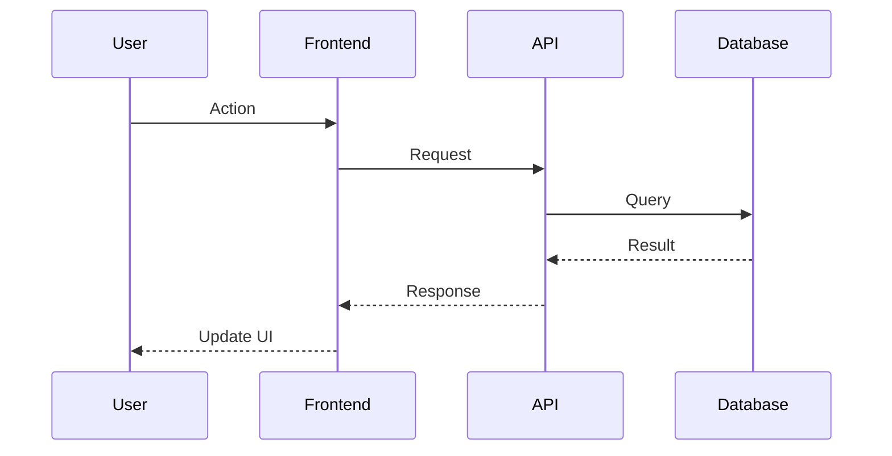

# Sprint [NUMBER]: [TITLE]

> **Duration**: [DATE] — [DATE]
> **Status**: [PLANNING | IN_PROGRESS | REVIEW | DONE]
> **Sprint Goal**: [ONE SENTENCE]

---

## Table of Contents

1. [Sprint Goal](#1-sprint-goal)
2. [Business Requirements](#2-business-requirements)
3. [Functional Requirements](#3-functional-requirements)
4. [Non-Functional Requirements](#4-non-functional-requirements)
5. [User Stories](#5-user-stories)
6. [Use Cases](#6-use-cases)
7. [Acceptance Criteria](#7-acceptance-criteria)
8. [Architecture Diagram](#8-architecture-diagram)
9. [C4 Architecture](#9-c4-architecture)
10. [Sequence Diagrams](#10-sequence-diagrams)
11. [Database Design](#11-database-design)
12. [Prisma Schema](#12-prisma-schema)
13. [API Contracts](#13-api-contracts)
14. [Folder Structure](#14-folder-structure)
15. [Backend Design](#15-backend-design)
16. [AI Service Design](#16-ai-service-design)
17. [Frontend Design](#17-frontend-design)
18. [Event-Driven Design](#18-event-driven-design)
19. [Security Design](#19-security-design)
20. [Scalability Design](#20-scalability-design)
21. [Performance Design](#21-performance-design)
22. [Caching Strategy](#22-caching-strategy)
23. [Observability](#23-observability)
24. [Feature Flags](#24-feature-flags)
25. [Unit Tests](#25-unit-tests)
26. [Integration Tests](#26-integration-tests)
27. [Contract Tests](#27-contract-tests)
28. [E2E Tests](#28-e2e-tests)
29. [Load Tests](#29-load-tests)
30. [Chaos Tests](#30-chaos-tests)
31. [CI/CD](#31-cicd)
32. [Deployment](#32-deployment)
33. [Documentation](#33-documentation)
34. [Definition of Done](#34-definition-of-done)

---

## 1. Sprint Goal

[WHY this sprint exists. One sentence max.]

---

## 2. Business Requirements

### Why does this feature exist?

[Business justification]

### Who uses it?

| User Type | Frequency      | Device           |
| --------- | -------------- | ---------------- |
| [Role]    | [Daily/Weekly] | [Mobile/Desktop] |

### Business Rules

| #     | Rule               | Priority |
| ----- | ------------------ | -------- |
| BR-01 | [Rule description] | P0/P1/P2 |

### Edge Cases

| #     | Edge Case             | Handling           |
| ----- | --------------------- | ------------------ |
| EC-01 | [What could go wrong] | [How we handle it] |

### Failure Scenarios

| #     | Scenario  | Impact   | Recovery   |
| ----- | --------- | -------- | ---------- |
| FS-01 | [Failure] | [Impact] | [Recovery] |

---

## 3. Functional Requirements

| ID    | Requirement               | Priority | Status      |
| ----- | ------------------------- | -------- | ----------- |
| FR-01 | [What the system must do] | P0/P1/P2 | [Done/Todo] |

---

## 4. Non-Functional Requirements

| ID     | Requirement      | Target  | Measurement    |
| ------ | ---------------- | ------- | -------------- |
| NFR-01 | Response time    | <200ms  | APM logs       |
| NFR-02 | Availability     | 99.9%   | Uptime monitor |
| NFR-03 | Concurrent users | 1000    | Load test      |
| NFR-04 | Data retention   | 7 years | DB policy      |

---

## 5. User Stories

### US-01: [Title]

**As a** [user type]
**I want to** [action]
**So that** [benefit]

**Acceptance Criteria:**

- [ ] [Criterion 1]
- [ ] [Criterion 2]

**Story Points**: [1/2/3/5/8/13]
**Priority**: [P0/P1/P2]

---

## 6. Use Cases

### UC-01: [Title]

**Actor**: [Who]
**Precondition**: [State before]
**Trigger**: [What starts it]

**Main Flow:**

1. [Step 1]
2. [Step 2]
3. [Step 3]

**Alternative Flow:**

1. [Step 1]
2. [Step 2a] → [Step 3]

**Exception Flow:**

1. [Step 1 fails] → [Error handling]

**Postcondition**: [State after]

---

## 7. Acceptance Criteria

| ID    | Given          | When     | Then              | Status      |
| ----- | -------------- | -------- | ----------------- | ----------- |
| AC-01 | [Precondition] | [Action] | [Expected result] | [PASS/FAIL] |

---

## 8. Architecture Diagram

```
[Mermaid or ASCII diagram showing how this sprint's features fit into the overall architecture]

Example:
┌─────────────┐     ┌──────────────┐     ┌─────────────┐
│   Angular   │────▶│   NestJS     │────▶│  Supabase   │
│   Frontend  │     │   API        │     │  PostgreSQL │
└─────────────┘     └──────┬───────┘     └─────────────┘
                           │
                    ┌──────▼───────┐
                    │   FastAPI    │
                    │   AI Service │
                    └──────────────┘
```

---

## 9. C4 Architecture

### Level 1: System Context

[How this feature fits in the overall system]

### Level 2: Container

[Which services/containers are involved]

### Level 3: Component

[Internal components of each service]

### Level 4: Code

[Key classes/modules/interfaces]

---

## 10. Sequence Diagrams

### Flow 1: [Name]



---

## 11. Database Design

### Tables

| Table   | Purpose   | Partitioned | Archived |
| ------- | --------- | ----------- | -------- |
| [table] | [purpose] | [yes/no]    | [yes/no] |

### Indexes

| Table   | Columns   | Type             | Purpose |
| ------- | --------- | ---------------- | ------- |
| [table] | [columns] | [btree/hash/gin] | [why]   |

### Composite Indexes

| Table   | Columns      | Purpose |
| ------- | ------------ | ------- |
| [table] | [col1, col2] | [why]   |

### Audit Fields (Every Table)

| Field      | Type      | Description        |
| ---------- | --------- | ------------------ |
| id         | UUID      | Primary key        |
| created_at | TIMESTAMP | Creation time      |
| updated_at | TIMESTAMP | Last update        |
| created_by | UUID      | Creator user ID    |
| updated_by | UUID      | Last modifier      |
| version    | INT       | Optimistic locking |
| is_deleted | BOOLEAN   | Soft delete        |

### Partition Strategy

| Table   | Partition Key | Method            | Rationale |
| ------- | ------------- | ----------------- | --------- |
| [table] | [key]         | [range/list/hash] | [why]     |

### Archive Strategy

| Table   | Archive After | Destination | Method |
| ------- | ------------- | ----------- | ------ |
| [table] | [time]        | [where]     | [how]  |

### Backup Strategy

| Database | Frequency | Retention   | Method             | RTO    | RPO    |
| -------- | --------- | ----------- | ------------------ | ------ | ------ |
| [db]     | [freq]    | [retention] | [pg_dump/snapshot] | [time] | [time] |

---

## 12. Prisma Schema

```prisma
// [Complete schema for this sprint's tables]
model [TableName] {
  id          String   @id @default(uuid()) @db.Uuid
  created_at  DateTime @default(now())
  updated_at  DateTime @updatedAt
  created_by  String?  @db.Uuid
  updated_by  String?  @db.Uuid
  version     Int      @default(1)
  is_deleted  Boolean  @default(false)
  // ... fields
}
```

---

## 13. API Contracts

### [METHOD] /api/v1/[endpoint]

**Description**: [What it does]

**Headers:**

```
Authorization: Bearer <token>
Content-Type: application/json
```

**Request Body:**

```json
{
  "field": "value"
}
```

**Response 200:**

```json
{
  "success": true,
  "data": {}
}
```

**Response 400:**

```json
{
  "success": false,
  "error": {
    "code": "VALIDATION_ERROR",
    "message": "Invalid input"
  }
}
```

**Response 401:**

```json
{
  "success": false,
  "error": {
    "code": "UNAUTHORIZED",
    "message": "Invalid token"
  }
}
```

**Rate Limit:** [X] requests per [time window]
**Cache:** [TTL] seconds

---

## 14. Folder Structure

```
[Files to create/modify this sprint]
apps/
├── api-nest/src/
│   └── features/[feature]/
│       ├── [feature].module.ts
│       ├── [feature].controller.ts
│       ├── [feature].service.ts
│       ├── dto/
│       ├── guards/
│       ├── interceptors/
│       └── tests/
├── ai-fastapi/app/
│   └── [feature]/
├── web-angular/src/app/
│   └── features/[feature]/
```

---

## 15. Backend Design

### Service Layer

| Service   | Responsibility | Dependencies    |
| --------- | -------------- | --------------- |
| [Service] | [What it does] | [What it needs] |

### Guards

| Guard   | Purpose      | Applied To |
| ------- | ------------ | ---------- |
| [Guard] | [Protection] | [Routes]   |

### Interceptors

| Interceptor   | Purpose                 | Applied To |
| ------------- | ----------------------- | ---------- |
| [Interceptor] | [Cross-cutting concern] | [Routes]   |

### DTOs

| DTO       | Purpose        | Fields   |
| --------- | -------------- | -------- |
| [DtoName] | [Input/Output] | [fields] |

### Validation Rules

| Field   | Rules                         | Error Message |
| ------- | ----------------------------- | ------------- |
| [field] | [required, min, max, pattern] | [message]     |

### Error Handling

| Error Code | HTTP Status | Message   | Recovery       |
| ---------- | ----------- | --------- | -------------- |
| [CODE]     | [status]    | [message] | [what happens] |

### Logging

| Event   | Level             | Data          | Retention  |
| ------- | ----------------- | ------------- | ---------- |
| [event] | [info/warn/error] | [what to log] | [how long] |

---

## 16. AI Service Design

### Prompt Templates

| ID    | Template | Variables | Model          | Version |
| ----- | -------- | --------- | -------------- | ------- |
| PT-01 | [prompt] | [vars]    | [gpt-4/claude] | [v1]    |

### Model Routing

| Use Case   | Primary Model | Fallback   | Rationale |
| ---------- | ------------- | ---------- | --------- |
| [use case] | [model]       | [fallback] | [why]     |

### Token Usage & Cost

| Operation | Input Tokens | Output Tokens | Cost/1K | Daily Est. |
| --------- | ------------ | ------------- | ------- | ---------- |
| [op]      | [est]        | [est]         | [cost]  | [total]    |

### Guardrails

| Check   | Method | Action on Fail |
| ------- | ------ | -------------- |
| [check] | [how]  | [what happens] |

### Hallucination Detection

| Method   | Threshold | Action     |
| -------- | --------- | ---------- |
| [method] | [score]   | [fallback] |

### Evaluation

| Dataset   | Metric   | Target   | Current  |
| --------- | -------- | -------- | -------- |
| [dataset] | [metric] | [target] | [actual] |

### A/B Testing

| Experiment | Variant A | Variant B | Metric   | Duration |
| ---------- | --------- | --------- | -------- | -------- |
| [exp]      | [control] | [test]    | [metric] | [time]   |

### Caching

| Response Type | TTL    | Invalidation |
| ------------- | ------ | ------------ |
| [type]        | [time] | [trigger]    |

### Human Feedback

| Feedback Type    | Collection   | Storage    | Usage             |
| ---------------- | ------------ | ---------- | ----------------- |
| [thumbs up/down] | [UI element] | [DB table] | [improve prompts] |

### Explainability

| Feature    | Output                  | UI Display  |
| ---------- | ----------------------- | ----------- |
| [AI Score] | [confidence, reasoning] | [component] |

---

## 17. Frontend Design

### Component Hierarchy

```
[feature]/
├── [feature]-page/          # Page component
├── components/
│   ├── [component-a]/       # Sub-component
│   └── [component-b]/
├── services/
│   └── [feature].service.ts # API calls
├── models/
│   └── [feature].model.ts   # TypeScript interfaces
└── [feature]-routing.module.ts
```

### Design Tokens

| Token   | Value   | Usage        |
| ------- | ------- | ------------ |
| [token] | [value] | [where used] |

### Responsive Breakpoints

| Breakpoint | Width      | Layout   |
| ---------- | ---------- | -------- |
| Mobile     | <640px     | [layout] |
| Tablet     | 640-1024px | [layout] |
| Desktop    | >1024px    | [layout] |

### Accessibility

| Requirement    | Implementation | Standard      |
| -------------- | -------------- | ------------- |
| Keyboard nav   | [how]          | WCAG 2.1 AA   |
| Screen reader  | [how]          | WCAG 2.1 AA   |
| Color contrast | [ratio]        | 4.5:1 minimum |

### Loading States

| State        | UI         | Duration    |
| ------------ | ---------- | ----------- |
| Initial load | Skeleton   | Until data  |
| Refresh      | Spinner    | Until data  |
| Error        | Error card | Until retry |

---

## 18. Event-Driven Design

### Events

| Event        | Producer  | Consumer  | Trigger          |
| ------------ | --------- | --------- | ---------------- |
| [event.name] | [service] | [service] | [what causes it] |

### Message Format

```json
{
  "event": "[event.name]",
  "timestamp": "ISO8601",
  "data": {},
  "metadata": {
    "correlationId": "uuid",
    "version": "1.0"
  }
}
```

### Retry Policy

| Event   | Max Retries | Backoff    | Dead Letter |
| ------- | ----------- | ---------- | ----------- |
| [event] | [n]         | [strategy] | [queue]     |

---

## 19. Security Design

### Authentication

| Method   | Token Type    | Expiry | Refresh  |
| -------- | ------------- | ------ | -------- |
| [method] | [JWT/session] | [time] | [yes/no] |

### Authorization

| Role   | Permissions  | Resource   |
| ------ | ------------ | ---------- |
| [role] | [can/cannot] | [resource] |

### Rate Limiting

| Endpoint   | Limit | Window | Burst | Response |
| ---------- | ----- | ------ | ----- | -------- |
| [endpoint] | [n]   | [time] | [n]   | [429]    |

### Input Validation

| Endpoint   | Field   | Rules   | Sanitization |
| ---------- | ------- | ------- | ------------ |
| [endpoint] | [field] | [rules] | [method]     |

### CORS

| Origin   | Methods   | Credentials |
| -------- | --------- | ----------- |
| [origin] | [methods] | [yes/no]    |

### Security Headers

| Header                    | Value            | Purpose           |
| ------------------------- | ---------------- | ----------------- |
| Content-Security-Policy   | [policy]         | XSS prevention    |
| X-Frame-Options           | DENY             | Clickjacking      |
| Strict-Transport-Security | max-age=31536000 | HTTPS enforcement |

### Secrets Management

| Secret   | Location     | Rotation    | Access |
| -------- | ------------ | ----------- | ------ |
| [secret] | [.env/vault] | [frequency] | [who]  |

### Audit Trail

| Action   | Who    | What       | When        | Where |
| -------- | ------ | ---------- | ----------- | ----- |
| [action] | [user] | [resource] | [timestamp] | [IP]  |

---

## 20. Scalability Design

### Current Scale (Day 1)

```
100 Users
├── Angular (CDN)
├── NestJS (1 instance)
├── FastAPI (1 instance)
├── Supabase (managed)
└── Redis (1 instance)
```

### 10K Users

```
Load Balancer
├── NestJS x3
├── FastAPI x2
├── Redis (1 instance)
└── Supabase (managed)
```

### 100K Users

```
API Gateway
├── Kubernetes
├── Kafka
├── Redis Cluster
├── PostgreSQL Read Replica
└── Supabase Pro
```

### 1M Users

```
CDN
├── Global Load Balancer
├── Kubernetes (auto-scale)
├── Kafka Cluster
├── Redis Cluster
├── ElasticSearch
├── ClickHouse (analytics)
├── S3 (assets)
└── PostgreSQL Cluster
```

### What Changes at Each Stage

| Stage | Infrastructure   | Code Changes | Cost Est. |
| ----- | ---------------- | ------------ | --------- |
| 100   | Single server    | None         | ~$50/mo   |
| 10K   | Load balancer    | None         | ~$200/mo  |
| 100K  | K8s + Kafka      | Event-driven | ~$2K/mo   |
| 1M    | Full distributed | CQRS + ES    | ~$20K/mo  |

---

## 21. Performance Design

### Latency Budget

| Operation    | Target | Measurement   |
| ------------ | ------ | ------------- |
| Page load    | <2s    | Lighthouse    |
| API response | <200ms | APM           |
| DB query     | <50ms  | pg_stat       |
| AI response  | <5s    | Custom metric |

### Resource Budget

| Resource  | Target | Current   |
| --------- | ------ | --------- |
| CPU       | <70%   | [measure] |
| Memory    | <80%   | [measure] |
| Storage   | <80%   | [measure] |
| Bandwidth | <70%   | [measure] |

### Optimization Strategies

| Area   | Strategy   | Impact                 |
| ------ | ---------- | ---------------------- |
| [area] | [strategy] | [expected improvement] |

---

## 22. Caching Strategy

### Cache Layers

| Layer   | Technology     | TTL    | Invalidation |
| ------- | -------------- | ------ | ------------ |
| Browser | Service Worker | [time] | [trigger]    |
| CDN     | CloudFront     | [time] | [trigger]    |
| API     | Redis          | [time] | [trigger]    |
| DB      | Query Cache    | [time] | [trigger]    |

### Cache Keys

| Key Pattern | Data   | TTL    | Invalidation |
| ----------- | ------ | ------ | ------------ |
| [pattern]   | [what] | [time] | [trigger]    |

### Cache Stampede Prevention

| Strategy           | Implementation |
| ------------------ | -------------- |
| Lock               | [how]          |
| Background refresh | [when]         |

---

## 23. Observability

### Logging

| Level | When        | Retention | Tool    |
| ----- | ----------- | --------- | ------- |
| DEBUG | Dev only    | 7 days    | Console |
| INFO  | Normal ops  | 30 days   | [tool]  |
| WARN  | Degraded    | 90 days   | [tool]  |
| ERROR | Failures    | 1 year    | [tool]  |
| FATAL | System down | Forever   | [tool]  |

### Metrics

| Metric   | Type                      | Labels   | Alert       |
| -------- | ------------------------- | -------- | ----------- |
| [metric] | [counter/gauge/histogram] | [labels] | [condition] |

### Tracing

| Operation | Span   | Attributes |
| --------- | ------ | ---------- |
| [op]      | [what] | [data]     |

### Dashboards

| Dashboard | Metrics   | Audience | Refresh    |
| --------- | --------- | -------- | ---------- |
| [name]    | [metrics] | [who]    | [interval] |

### Alerts

| Alert   | Condition   | Severity | Action     |
| ------- | ----------- | -------- | ---------- |
| [alert] | [condition] | [P1-P4]  | [who/what] |

---

## 24. Feature Flags

| Flag   | Purpose | Default  | Rollout |
| ------ | ------- | -------- | ------- |
| [flag] | [why]   | [on/off] | [%]     |

### Rollout Strategy

| Phase  | % Users | Duration | Rollback       |
| ------ | ------- | -------- | -------------- |
| Canary | 1%      | 1 day    | Auto if errors |
| Beta   | 10%     | 3 days   | Auto if errors |
| GA     | 100%    | —        | Manual         |

---

## 25. Unit Tests

### Coverage Targets

| Module      | Target | Current |
| ----------- | ------ | ------- |
| Services    | 90%    | —       |
| Controllers | 85%    | —       |
| Utils       | 95%    | —       |

### Test Cases

| ID    | Test   | Input   | Expected | Type                |
| ----- | ------ | ------- | -------- | ------------------- |
| UT-01 | [what] | [input] | [output] | [positive/negative] |

---

## 26. Integration Tests

### Test Scenarios

| ID    | Scenario   | Components | Expected |
| ----- | ---------- | ---------- | -------- |
| IT-01 | [scenario] | [services] | [result] |

### Test Data

| Scenario | Setup       | Teardown  |
| -------- | ----------- | --------- |
| [name]   | [seed data] | [cleanup] |

---

## 27. Contract Tests

### API Contracts

| Endpoint   | Consumer   | Provider  | Status     |
| ---------- | ---------- | --------- | ---------- |
| [endpoint] | [frontend] | [backend] | [verified] |

### Schema Validation

| Contract | Schema    | Version | Validated |
| -------- | --------- | ------- | --------- |
| [name]   | [OpenAPI] | [v1]    | [yes/no]  |

---

## 28. E2E Tests

### Test Scenarios

| ID     | Flow   | Steps   | Expected | Priority |
| ------ | ------ | ------- | -------- | -------- |
| E2E-01 | [flow] | [steps] | [result] | P0       |

### Browser Coverage

| Browser | Version | Priority |
| ------- | ------- | -------- |
| Chrome  | Latest  | P0       |
| Safari  | Latest  | P1       |
| Firefox | Latest  | P2       |

---

## 29. Load Tests

### Test Scenarios

| Scenario | Users | Duration | RPS | Threshold  |
| -------- | ----- | -------- | --- | ---------- |
| Normal   | 100   | 10min    | 50  | <200ms p95 |
| Peak     | 500   | 5min     | 200 | <500ms p95 |
| Stress   | 1000  | 5min     | 500 | <1s p95    |

### Performance Thresholds

| Metric            | Warning | Critical |
| ----------------- | ------- | -------- |
| Response time p95 | >200ms  | >500ms   |
| Error rate        | >1%     | >5%      |
| CPU               | >70%    | >90%     |
| Memory            | >80%    | >95%     |

---

## 30. Chaos Tests

### Test Scenarios

| ID    | Scenario      | Impact   | Expected Behavior | Blast Radius |
| ----- | ------------- | -------- | ----------------- | ------------ |
| CT-01 | [what breaks] | [effect] | [system behavior] | [% affected] |

### Resilience Patterns

| Pattern         | Implementation | Tested   |
| --------------- | -------------- | -------- |
| Circuit Breaker | [how]          | [yes/no] |
| Retry           | [how]          | [yes/no] |
| Bulkhead        | [how]          | [yes/no] |
| Timeout         | [how]          | [yes/no] |

---

## 31. CI/CD

### Pipeline Stages

| Stage          | Steps   | Duration | Fail Action |
| -------------- | ------- | -------- | ----------- |
| Lint           | [steps] | [time]   | Block       |
| Test           | [steps] | [time]   | Block       |
| Build          | [steps] | [time]   | Block       |
| Deploy Staging | [steps] | [time]   | Auto        |
| Deploy Prod    | [steps] | [time]   | Manual      |

### Environments

| Environment | Branch    | Auto Deploy | Approvals |
| ----------- | --------- | ----------- | --------- |
| Dev         | feature/* | Yes         | None      |
| Staging     | main      | Yes         | None      |
| Prod        | release/* | No          | Manual    |

---

## 32. Deployment

### Deployment Strategy

| Service   | Strategy                    | Downtime       | Rollback |
| --------- | --------------------------- | -------------- | -------- |
| [service] | [blue-green/canary/rolling] | [zero/minutes] | [how]    |

### Rollback Plan

| Trigger     | Steps   | Time to Rollback |
| ----------- | ------- | ---------------- |
| [condition] | [steps] | [time]           |

### Infrastructure

| Resource   | Provider      | Spec   | Cost   |
| ---------- | ------------- | ------ | ------ |
| [resource] | [AWS/GCP/etc] | [size] | [$/mo] |

---

## 33. Documentation

| Document     | Audience   | Location  | Status   |
| ------------ | ---------- | --------- | -------- |
| API Docs     | Developers | /api/docs | [status] |
| User Guide   | End users  | /docs     | [status] |
| Runbook      | Ops        | /runbooks | [status] |
| Architecture | Architects | /docs     | [status] |

---

## 34. Definition of Done

- [ ] All acceptance criteria met
- [ ] Code reviewed and approved
- [ ] Unit tests passing (>90% coverage)
- [ ] Integration tests passing
- [ ] No P0/P1 bugs open
- [ ] Security review complete
- [ ] Performance benchmarks met
- [ ] Documentation updated
- [ ] Deployed to staging
- [ ] Product owner verified
- [ ] Feature flag configured
- [ ] Monitoring dashboards updated
- [ ] Alerts configured
- [ ] Runbook updated
- [ ] Rollback plan documented

---

## Sprint Notes

### Decisions Made

| Decision   | Rationale | Date   |
| ---------- | --------- | ------ |
| [decision] | [why]     | [date] |

### Risks Identified

| Risk   | Impact   | Probability    | Mitigation |
| ------ | -------- | -------------- | ---------- |
| [risk] | [impact] | [high/med/low] | [action]   |

### Dependencies

| Dependency | Type                | Status   | Blocker  |
| ---------- | ------------------- | -------- | -------- |
| [dep]      | [internal/external] | [status] | [yes/no] |

### Velocity

| Metric            | Value |
| ----------------- | ----- |
| Planned Stories   | [n]   |
| Completed Stories | [n]   |
| Story Points      | [n]   |
| Bugs Found        | [n]   |
| Bugs Fixed        | [n]   |

---

## Scale-Specific Notes

### Current (100 Users)

- Single NestJS instance
- Supabase managed PostgreSQL
- Redis single instance
- No message queue

### 10K Users

- Add load balancer
- NestJS x3 instances
- Redis vertical scale
- Add read replica

### 100K Users

- Kubernetes migration
- Add Kafka for events
- Redis cluster
- PostgreSQL read replicas
- CDN for static assets

### 1M Users

- Global load balancer
- Kafka cluster
- ElasticSearch for search
- ClickHouse for analytics
- S3 for assets
- PostgreSQL cluster with sharding

---

_Template Version: 1.0_
_Last Updated: [DATE]_
